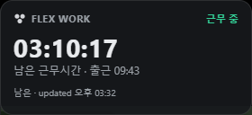
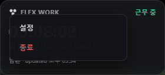
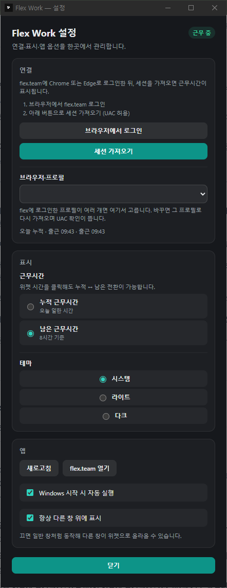

# Flex Work Widget

Windows 바탕화면에 띄워 두는 Flex 오늘 누적 근무시간 위젯입니다.  
`cursor-usage-widget`와 같은 Tauri 2 데스크톱 위젯 형태입니다.



테두리 없는 280×128 창이 바탕화면 위에 떠 있습니다. 작업 표시줄에는 잡히지 않습니다.

| 위치 | 내용 |
|---|---|
| 우측 상단 배지 | `출근 전` / `근무 중` / `휴게 중` / `퇴근` |
| 큰 숫자 | 현재 표시 모드의 시간 (`HH:MM:SS`) — 근무 중이면 1초마다 올라갑니다 |
| 그 아래 줄 | 표시 모드 이름 · 오늘 출근 시각 |
| 맨 아래 줄 | 표시 모드 약어 · 마지막 갱신 시각 (연결 전이면 `우클릭 → 설정에서 연결`) |

## 사용법

1. `시작.bat` 으로 실행하면 위젯이 마지막 위치에 뜹니다
2. 처음 한 번은 [첫 연결](#첫-연결)로 flex 세션을 가져옵니다
3. **큰 숫자를 클릭**하면 누적 ↔ 남은 근무시간이 바뀝니다 ([표시 모드](#표시-모드))
4. 창을 **드래그**하면 옮겨집니다 — 위치는 다음 실행에 복원됩니다
5. 그 밖의 모든 조작은 **우클릭 메뉴**에서 합니다 ([우클릭 메뉴](#우클릭-메뉴), [설정](#설정))

## 범위 (MVP)

- 오늘 **누적 근무시간** 표시 (`HH:MM:SS`)
- **출근 전**이면 그 상태 표시
- 근무 중 / 휴게 중 / 퇴근 상태 구분
- flex 웹 로그인 세션 사용 (Open API 토큰 불필요)

## 데이터 경로

비공식 웹 세션 방식입니다.

1. 위젯에서 **flex 로그인** 창을 엽니다 (`https://flex.team`)
2. 로그인 후 웹뷰 세션/쿠키로 다음 API를 호출합니다  
   - `GET /api/v2/workspace/users/me/workspace-users`  
   - `GET /api/v2/time-tracking/work-clock/users/{userIdHash}/current-status`
3. 응답의 근무/휴게 블럭으로 오늘 누적 시간을 계산합니다

flex 웹 구조가 바뀌면 깨질 수 있습니다.

## 실행

일상 사용: `시작.bat`  
→ 릴리즈 exe를 `%LOCALAPPDATA%\FlexWorkWidget\`에 두고 실행합니다. 커맨드창은 남지 않습니다.  
→ 처음 한 번은 빌드가 필요할 수 있습니다 (`npm run build:app`).  
→ 위젯에서 **우클릭 → 시작프로그램** 으로 부팅 시 자동 실행을 켭니다.  
  (항상 위 설치 경로만 등록하므로, `target\debug` exe를 직접 켜도 시작프로그램이 깨지지 않습니다.)

개발(핫 리로드): `시작-개발.bat` 또는

```powershell
cd C:\Users\cykim\repo\flex-work-widget
npm install
npm run tauri dev
```

### 첫 연결

앱 내 로그인 창은 flex(특히 Google 로그인)에서 **하얀 화면**이 나므로 사용하지 않습니다.

위젯 **우클릭 → 설정** 에서:

1. **브라우저에서 로그인** (Chrome/Edge)
2. flex 홈까지 로그인 완료
3. **세션 가져오기**  
   - Chrome/Edge **모든 프로필**을 스캔하되, **지금 쓰는 프로필**(Chrome `last_used`)을 최우선으로 선택합니다
   - Chrome v130+ 쿠키 암호 때문에 **관리자 권한(UAC)** 확인이 뜹니다 → 허용 (관리자 권한이면 Chrome app-bound 암호도 복호화됩니다)
4. flex에 로그인한 프로필이 여러 개면, 설정의 **브라우저·프로필** 드롭다운에서 원하는 계정을 고릅니다  
   - 고르면 그 프로필로 다시 가져오며(UAC), 선택은 다음 실행에도 기억됩니다

의존성: `pip install rookiepy` (세션 가져오기 스크립트용)

## 우클릭 메뉴

위젯 아무 곳이나 **우클릭**하면 클릭한 자리에 메뉴가 열립니다. 바깥을 클릭하거나 `Esc`,
또는 다른 창으로 포커스가 넘어가면 닫힙니다.



- **설정** — 연결·표시·앱 옵션 (시작프로그램, 항상 위에 표시 포함)
- **종료** — 앱을 완전히 끕니다 (바로 아래 있으니 잘못 누르지 않도록 주의)

## 표시 모드

시간 숫자 클릭 또는 **우클릭 → 설정**에서 전환합니다.

- **누적 근무시간**: 오늘 근무한 시간
- **남은 근무시간**: `8시간 − 누적` (0 미만이면 00:00:00)

## 설정

**우클릭 → 설정** 으로 별도 창을 엽니다. 변경 사항은 **즉시** 메인 위젯에 반영됩니다
(저장 버튼 없음). `Esc` 또는 **닫기**로 닫으면 창은 숨겨질 뿐 앱은 계속 돕니다.



> 스크린샷은 스크롤 없이 전체가 보이도록 창을 늘린 모습입니다. 기본 크기는 440×620이라
> 실제로는 세로 스크롤이 생깁니다.

| 블록 | 하는 일 |
|---|---|
| **연결** | `브라우저에서 로그인` → flex 로그인 → `세션 가져오기`(UAC 허용). 카드 맨 아래 줄에 현재 세션 요약이, 연결이 안 됐으면 그 이유가 나옵니다. flex에 로그인한 프로필이 2개 이상일 때만 **브라우저·프로필** 드롭다운이 나타납니다 |
| **표시** | **근무시간**은 누적 ↔ 남은 전환, **테마**는 시스템/라이트/다크 |
| **앱** | `새로고침`(즉시 재조회), `flex.team 열기`(기본 브라우저), `Windows 시작 시 자동 실행`, `항상 다른 창 위에 표시` |

창 우측 상단 배지는 위젯과 같은 현재 근무 상태입니다.

**항상 다른 창 위에 표시**를 끄면 일반 창처럼 동작해서 다른 창이 위젯을 덮을 수 있습니다.
이 선택은 백엔드가 들고 있어 재시작 후에도 유지됩니다.

## 테마

설정 창 **표시 → 테마**에서 선택합니다. 기본값은 **시스템**입니다.

## 개발·배포

- 에이전트/개발자 작업 완료 후 강제 재빌드·재시작: `npm run rebuild:restart`
- 일반 사용자: `시작.bat` (소스가 exe보다 최신일 때만 빌드, 설치본 해시 불일치 시 재복사)
- 재시작 스크립트는 **빌드 전에** 기존 위젯을 모두 종료한다 (구 UI가 남지 않음)

우클릭 → **종료**로 앱을 닫습니다.

## 개발 메모

- 세션 파일: `%LOCALAPPDATA%\FlexWorkWidget\session.json` (커밋 금지)
- 프로필 후보 목록: `candidates.json` (쿠키 값 없음, 메타데이터만) / 선택 기억: `harvest-pref.json`
- 웹뷰 데이터: `%LOCALAPPDATA%\FlexWorkWidget\webview\`
- 폴링 기본 간격: 60초 (근무 중에는 UI에서 1초 단위로 로컬 틱)
- Windows WebView2 `cookies_for_url`로 HttpOnly 쿠키까지 읽습니다
